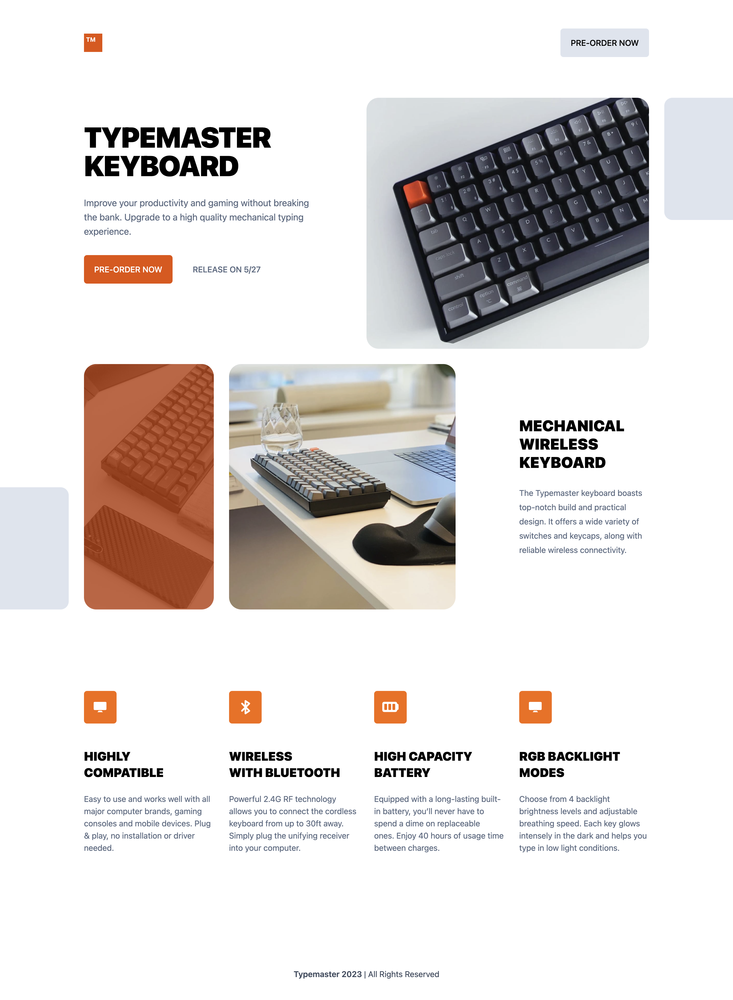

# Frontend Mentor - Typemaster pre-launch landing page solution

This is a solution to the [Typemaster pre-launch landing page challenge on Frontend Mentor](). Frontend Mentor challenges help you improve your coding skills by building realistic projects.

## Table of contents

- [Frontend Mentor - Typemaster pre-launch landing page solution](#frontend-mentor---typemaster-pre-launch-landing-page-solution)
  - [Table of contents](#table-of-contents)
  - [Overview](#overview)
    - [The challenge](#the-challenge)
    - [Screenshot](#screenshot)
    - [Links](#links)
  - [My process](#my-process)
    - [Built with](#built-with)
    - [What I learned](#what-i-learned)
    - [Continued development](#continued-development)
    - [Useful resources](#useful-resources)
  - [Author](#author)

**Note: Delete this note and update the table of contents based on what sections you keep.**

## Overview

### The challenge

The goal was to build out this landing page and get it looking as close to the figma design as possible. I could use any tools I like to complete the challenge.

Users should be able to:

- View the optimal layout depending on their device's screen size
- See hover states for interactive elements

### Screenshot



### Links

- Solution URL: [Add solution URL here](https://your-solution-url.com)
- Live Site URL: [Add live site URL here](https://your-live-site-url.com)

## My process

### Built with

- Semantic HTML5 markup
- Tailwindcss
- Flexbox
- CSS Grid
- Mobile-first workflow
- Parcel

### What I learned

picture element
adding an overlay over an image

Use this section to recap over some of your major learnings while working through this project. Writing these out and providing code samples of areas you want to highlight is a great way to reinforce your own knowledge.

To see how you can add code snippets, see below:

```html
<h1>Some HTML code I'm proud of</h1>
```

```css
.proud-of-this-css {
  color: papayawhip;
}
```

```js
const proudOfThisFunc = () => {
  console.log("🎉");
};
```

### Continued development

Use this section to outline areas that you want to continue focusing on in future projects. These could be concepts you're still not completely comfortable with or techniques you found useful that you want to refine and perfect.

- implement dark mode switcher

**Note: Delete this note and the content within this section and replace with your own plans for continued development.**

### Useful resources

- [Example resource 1](https://www.example.com) - This helped me for XYZ reason. I really liked this pattern and will use it going forward.
- tailwindcss docs
- [Example resource 2](https://www.example.com) - This is an amazing article which helped me finally understand XYZ. I'd recommend it to anyone still learning this concept.
- mdn picture docs

## Author

- Website - [Chris Mendez](https://www.cjmendez.com)
- Frontend Mentor - [@cmendez20](https://www.frontendmentor.io/profile/cmendez20)
- Twitter - [@CMendecj812](https://www.x.com/cmendecj812)
